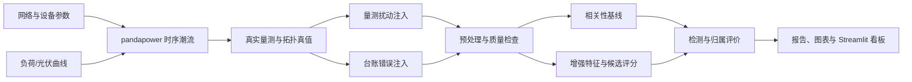

# 配电网线变关系智能校验系统

> 面向电网/能源数字化实习的可复现研究型原型。

基于时序量测与潮流仿真的配电网线变关系智能校验系统（distribution-network-line-transformer-verification）。利用同一馈线下配变电压与功率变化中的共同运行特征，自动校验"10 kV 馈线—配电变压器"台账归属，输出疑似错误告警、最可能的正确馈线、匹配分数与可解释证据。

## 业务背景

配电网线路改造、负荷迁移和台账维护不同步时，系统记录的馈线—配变从属关系可能与现场物理连接不一致。错误台账影响线损分析、停电范围研判、负荷统计、故障定位和营配调数据贯通。本项目把电力机理转化为可复现的数据算法系统：先由 pandapower 潮流仿真生成物理量测与错误台账，再用可解释统计特征完成异常检测与正确馈线推荐，全部结果可追溯至固定命令与运行清单。



## 方法

- **数据生成**：默认网络含 110 kV 外部电网、110/10 kV 主变、3 条 10 kV 馈线（每条 8 台 10/0.4 kV 配变），30 天、15 分钟分辨率、随机种子 42，平衡正序交流潮流。
- **错误台账**：只修改台账副本（默认 20% 配变），物理网络不变；physical_feeder_id 与 is_mislinked 只进入真值/评价流程，禁止进入模型特征。
- **预处理**：15 分钟网格对齐、短缺口时间插值（长缺口保留）、行中位数公共电压趋势消除、一阶差分。
- **基线方法**：原始电压 Pearson 相关 + 群组中心（候选自身始终排除）。
- **增强评分**：原始/残差/差分相关、滚动窗口相关中位数与低分位数、电压突变事件 Jaccard 匹配、有功功率相关，配置化加权求和（权重与阈值为预先固定的启发式参数，尚未经独立验证集标定；测试场景不参与任何选择）。
- **保守判定**：当前匹配分低于阈值且分数间隔超过阈值才判疑似错误；覆盖率不足时输出"数据不足"，不强行给出高置信结论。

## 快速开始

首次使用建议先阅读[完整使用说明](docs/user-guide.md)，其中包含安装、命令行、五个看板页面、产物字段、公开证据复现和故障排查。项目的问题定义、方法、实验结果与失效边界见[项目论文（Markdown）](paper/line-transformer-verification-paper.md)或[排版版 PDF](paper/line-transformer-verification-paper.pdf)。

Windows:

```text
py -3.12 -m venv .venv
.venv/Scripts/python.exe -m pip install -e ".[dev]"
```

Linux/macOS:

```bash
python3 -m venv .venv
.venv/bin/python -m pip install -e ".[dev]"
```

小规模冒烟运行（3 馈线 × 3 配变、1 天、6 小时间隔）：

Windows:

```text
.venv/Scripts/python.exe -m ltverify run-all --config tests/fixtures/small_config.yaml
```

Linux/macOS:

```bash
.venv/bin/python -m ltverify run-all --config tests/fixtures/small_config.yaml
```

默认 30 天完整流水线：

```text
scripts/run_pipeline.ps1
```

或等价命令（Windows）：

```text
.venv/Scripts/python.exe -m ltverify run-all --config configs/default.yaml
```

启动看板（需要一个已完成运行的目录）：

```text
scripts/run_dashboard.ps1 -RunDir <运行目录>
```

或：

Windows:

```text
.venv/Scripts/python.exe -m streamlit run app/streamlit_app.py
```

Linux/macOS:

```bash
.venv/bin/python -m streamlit run app/streamlit_app.py
```

看板默认使用简体中文，可在侧边栏的“界面语言”中切换为 English。语言切换覆盖入口、五个业务页面、图表、指标卡与展示表格；配变编号、馈线编号、文件路径、命令、单位和 SHA-256 等技术标识保持原样。翻译只作用于展示副本，不修改运行产物、算法字段或证据哈希。

三个可从头执行的教学 Notebook：notebooks/01_network_sanity.ipynb（网络健全性）、notebooks/02_baseline_analysis.ipynb（基线对比）、notebooks/03_robustness_analysis.ipynb（鲁棒性聚合）。

## 质量与复现

本地质量门禁：

```text
.venv/Scripts/python.exe -m ruff format --check src app tests scripts
.venv/Scripts/python.exe -m ruff check src app tests scripts
.venv/Scripts/python.exe -m pytest --cov=ltverify --cov-report=term-missing --cov-fail-under=90 -q
```

GitHub Actions 已配置 `.github/workflows/ci.yml`，在 push/PR 时对 Python 3.11 与 3.12 运行格式检查、静态检查、测试与 wheel 构建。

公开证据包复现（写入系统临时目录，不覆盖仓库权威文件）：

```powershell
$auditOut = Join-Path $env:TEMP "ltverify-public-evidence"
New-Item -ItemType Directory -Path $auditOut -Force | Out-Null
.venv/Scripts/python.exe -m ltverify report `
  --run-dir reports/evidence/default_run `
  --output (Join-Path $auditOut "default_summary.json") `
  --manifest-output (Join-Path $auditOut "default_manifest.json")
```

Linux/macOS 等价命令：

```bash
auditOut=$(mktemp -d)
.venv/bin/python -m ltverify report \
  --run-dir reports/evidence/default_run \
  --output "$auditOut/default_summary.json" \
  --manifest-output "$auditOut/default_manifest.json"
```

生成结果应与 `reports/metrics/default_summary.json`、`reports/metrics/default_manifest.json` 逐字节一致。

**两种复现语义：**
- 公开证据复现：验证历史权威 run，并逐字节生成规范报告。
- 重新运行仿真：从 `configs/default.yaml` 生成新的 run，用于验证算法流程；run_id、时间戳与 manifest commit 会不同。

更多信任边界与公开审计说明：
- [AI 使用说明](AI_USAGE.md)
- [公开审计摘要](docs/audit-summary.md)
- [设计说明](docs/design.md)
- [方法论](docs/methodology.md)
- [面试指南](docs/interview-guide.md)
- [数据字典](data/README.md)

## 实验设计

- 已实现：E0 物理与数据检查、鲁棒性矩阵（台账错误率/噪声/缺失/时间错位/光伏五个单因素族，各 4 水平 × 5 种子）与 6 个消融 × 5 种子，共 130 个案例；每个案例记录逐时刻收敛率、物理违规数与电压/负载率范围。
- 规划中（后续工作）：E1 方法对比中的随机森林对照、E7 泛化，以及按仿真场景/日期块/随机种子分组的 60/20/20 训练/验证/测试划分（分组工具 grouped_scenario_split 已实现，尚未接入生产链路）。

```text
.venv/Scripts/python.exe -m ltverify experiments --config configs/robustness.yaml
```

主指标为 Precision、Recall、F1、PR-AUC（连续 anomaly_score）、Top-1、Top-2 与自动推荐覆盖率；三馈线场景下 Top-3 不适用（候选数 ≤ 3），不作为性能证据；Accuracy 不作为主结论。

## 结果

以下数字可由"质量与复现"章节的公开证据包命令逐字节复现；该命令从 `reports/evidence/default_run/` 读取历史权威 run，并同时生成临时 `default_summary.json` 与 `default_manifest.json`，不会覆盖仓库中的规范证据文件。

**物理检查说明**：零负荷网络的 base-case 检查只证明拓扑可解（收敛、电压与平衡基线）；逐时刻校验（每时刻收敛、电压范围、变压器负载率、功率平衡）由时序仿真记录并随运行产物输出。

**默认 30 天流水线**（运行 ID 20260816T121851Z-fb16e1，schema-v2 证据由 `.venv/Scripts/python.exe -m ltverify report` 生成：default_summary.json 与可移植副本 default_manifest.json）：

- 增强方法：Precision 0.143、Recall 0.200、F1 0.167、PR-AUC 0.378（连续 anomaly_score 全样本口径）、PR-AUC（scored 子集诊断口径）0.378（scored_coverage 1.0）、Top-1 修正率 0.2、Top-2 修正率 0.4、自动推荐覆盖率 0.292；Top-3 在三馈线场景标记为不适用。
- 基线（仅原始电压相关）：全部不触发告警，F1 0.0。
- 物理检查：base-case 检查收敛、电压 1.0–1.0001 p.u.、功率平衡误差 7.5e-14 MW；逐时刻校验 2880/2880 时刻收敛、电压 0.964–1.0 p.u.、全部时刻 severity=ok（记录于运行目录 simulation_validation.csv）。

**诚实结论与失败边界**：默认参数化下，合成数据的电压特征无法区分馈线——实测同馈线配变残差电压相关系数均值 −0.064 与跨馈线 +0.009 无方向性差异（84/192 对）。原因：馈线级电压共享分量约 2e-4 p.u.，远小于配变自身阻抗压降（约 4e-3 p.u.）与量测噪声（5e-4 p.u.）。增强方法优于基线但远低于 F1≥0.85 的研究目标；本项目按设计规格风险表应对项"报告失败边界"如实记录，后续改进方向为增加馈线线路阻抗与馈线级负荷差异。

**机会基线参照**：三候选均匀随机排序下，Top-1/Top-2 修正率的描述性期望约为 1/3 与 2/3；默认场景实际错误仅 5 台（n=5），样本过小，不能据此作显著性结论。

**口径说明**：PR-AUC 仅在测试集同时含正负样本时适用，单类别真值时为 null（不适用）而非 0；pr_auc_scored 为仅可评分子集的诊断口径，须与 scored_coverage 同时解读。Top-k 排名只接受有限分数与有限证据权重，NaN 与正负无穷候选一律排除并计数。配置快照 config.snapshot.yaml 纳入清单哈希闭环；report 命令先做 SHA-256 哈希一致性校验、后解析，未同步更新清单的产物变化会在读取前被拒绝。运行清单 input_paths 只保存可移植的配置文件名，不记录本机绝对路径或反斜杠路径；终止型 base-case 失败的 failure_summary 含 stage/severity/violation_count/violation_types/violations 结构化详情，且 running/failed/completed 三类 manifest 在配置快照成功写入后都保留 config.snapshot.yaml 哈希闭环并可通过 verify_manifest_hashes 自验证。物理越限默认零容忍（三类可配置工程违规——功率平衡/电压越限/变压器过载——均为 critical，terminate_on_critical=true 时流水线与实验案例失败）；潮流不收敛是不可降级的硬失败。base-case 违规详情（count/types/消息/severity）全量写入 metrics.json。主看板磁盘入口仅接受 current schema-v2；旧版、未来版和非法版在加载前拒绝并提示重新运行。页面内保留的 legacy/newer/invalid 分支仅作为旧 session/hot reload/直接页面测试的防御性保护，不构成受支持的旧 run 加载能力。Streamlit 最低版本 1.51；report 命令的源清单副本可通过 --manifest-output 显式指定（默认 <输出名>.manifest.json）。

**鲁棒性与消融实验**：130 案例矩阵的原始与聚合结果见 reports/metrics/robustness_summary.csv 与 robustness_aggregates.csv（含逐案例物理字段）；权威实验清单为 robustness_experiment_manifest.json（含实验配置与基础配置的哈希/快照，可用 verify_experiment_manifest 校验）。实验清单验证分两级：严格模式需同时传入 configs/robustness.yaml 与 configs/default.yaml 做 name/hash/snapshot 四方一致核验；离线模式只验证 schema、输出哈希、计数和字段格式，不冒充源配置核验。鲁棒性看板对当前 robustness_* 产物先做哈希一致性校验再展示，且 strict_verified 只适用于实际读取的精确 canonical 文件（robustness_aggregates.csv + robustness_summary.csv）；同目录其他 robustness_* 文件不会继承信任。旧 experiment_* 仅兼容展示并明确标记未验证；坏 CSV、缺列、目录路径、非对象 manifest、混合空值 family 或非法数值都会转为页面错误提示，不产生未捕获异常。当前清单未使用数字签名：它能检测意外损坏或未同步更新清单的修改；若攻击者可同时改写产物与同目录清单，单靠 SHA-256 不能证明发布者身份或来源真实性。

## 项目限制

- 第一版为平衡正序交流潮流仿真，不处理三相不平衡、相别识别与户变关系，不能宣称已现场部署或达到生产准确率。
- 全部数据为合成数据，结论只能表述为仿真验证。
- 第一版不使用 GNN、DTW、深度学习、实时数据库或真实电网敏感数据。
- 合成曲线的简单性可能使指标虚高；实验设计通过噪声、缺失、错位、光伏与新场景测试暴露真实边界。

## 仓库结构

```text
configs/          # 默认与鲁棒性实验配置
src/ltverify/     # 网络、曲线、潮流、扰动、特征、评分、评价、流水线与 CLI
app/              # Streamlit 中英文多页看板（默认简体中文）
notebooks/        # 网络健全性、基线对比、鲁棒性聚合三个可执行 Notebook
tests/            # 单元、集成与防泄漏测试
scripts/          # Windows 一键运行脚本
docs/             # 方法论、设计说明、公开审计摘要与面试指南
data/             # 数据目录与数据字典
.github/          # GitHub Actions CI 配置
AI_USAGE.md       # AI 使用说明
```

## 面试展示

建议按 30 秒业务痛点 → 30 秒数据生成 → 60 秒 Pearson 局限与增强方法 → 60 秒看板演示 → 主动说明限制的顺序展示，完整脚本与常见追问见 docs/interview-guide.md；算法公式与物理约定见 docs/methodology.md；字段字典见 data/README.md。

## 许可证

MIT，见 LICENSE。
