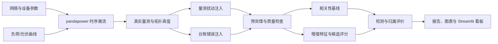

# 配电网线变关系智能校验系统

基于时序量测与潮流仿真的配电网线变关系智能校验系统（distribution-network-line-transformer-verification）。利用同一馈线下配变电压与功率变化中的共同运行特征，自动校验"10 kV 馈线—配电变压器"台账归属，输出疑似错误告警、最可能的正确馈线、匹配分数与可解释证据。

## 业务背景

配电网线路改造、负荷迁移和台账维护不同步时，系统记录的馈线—配变从属关系可能与现场物理连接不一致。错误台账影响线损分析、停电范围研判、负荷统计、故障定位和营配调数据贯通。本项目把电力机理转化为可复现的数据算法系统：先由 pandapower 潮流仿真生成物理量测与错误台账，再用可解释统计特征完成异常检测与正确馈线推荐，全部结果可追溯至固定命令与运行清单。



## 方法

- **数据生成**：默认网络含 110 kV 外部电网、110/10 kV 主变、3 条 10 kV 馈线（每条 8 台 10/0.4 kV 配变），30 天、15 分钟分辨率、随机种子 42，平衡正序交流潮流。
- **错误台账**：只修改台账副本（默认 20% 配变），物理网络不变；physical_feeder_id 与 is_mislinked 只进入真值/评价流程，禁止进入模型特征。
- **预处理**：15 分钟网格对齐、短缺口时间插值（长缺口保留）、行中位数公共电压趋势消除、一阶差分。
- **基线方法**：原始电压 Pearson 相关 + 群组中心（候选自身始终排除）。
- **增强评分**：原始/残差/差分相关、滚动窗口相关中位数与低分位数、电压突变事件 Jaccard 匹配、有功功率相关，配置化加权求和（权重在训练/验证场景确定，测试场景不参与）。
- **保守判定**：当前匹配分低于阈值且分数间隔超过阈值才判疑似错误；覆盖率不足时输出"数据不足"，不强行给出高置信结论。

## 快速开始

```text
py -3.12 -m venv .venv
.venv/Scripts/python.exe -m pip install -e ".[dev]"
```

小规模冒烟运行（3 馈线 × 3 配变、1 天、6 小时间隔）：

```text
python -m ltverify run-all --config tests/fixtures/small_config.yaml
```

默认 30 天完整流水线：

```text
scripts/run_pipeline.ps1
```

或等价命令：

```text
python -m ltverify run-all --config configs/default.yaml
```

启动看板（需要一个已完成运行的目录）：

```text
scripts/run_dashboard.ps1 -RunDir <运行目录>
```

或：

```text
streamlit run app/streamlit_app.py
```

三个可从头执行的教学 Notebook：notebooks/01_network_sanity.ipynb（网络健全性）、notebooks/02_baseline_analysis.ipynb（基线对比）、notebooks/03_robustness_analysis.ipynb（鲁棒性聚合）。

## 实验设计

- 数据划分：按仿真场景、日期块和随机种子分组，60% 训练 / 20% 验证 / 20% 测试，禁止随机打散全部时间点。
- 核心实验：E0 物理与数据检查、E1 方法对比（Pearson/增强/随机森林）、E2 台账错误率、E3 噪声、E4 缺失、E5 时间错位、E6 光伏、E7 泛化、E8 消融、E9 阈值敏感性。
- 鲁棒性矩阵：5 个单因素族 × 4 水平 × 5 种子 + 6 个消融 × 5 种子 = 130 个案例。

```text
python -m ltverify experiments --config configs/robustness.yaml
```

主指标为 Precision、Recall、F1、PR-AUC、Top-1、Top-3 与自动推荐覆盖率；Accuracy 不作为主结论。

## 结果

尚未运行完整实验，以下仅展示可复现流程，不报告性能结论。

完整实验完成后，本节将填入可追溯至运行 ID、manifest 与指标文件的实测数字。

## 项目限制

- 第一版为平衡正序交流潮流仿真，不处理三相不平衡、相别识别与户变关系，不能宣称已现场部署或达到生产准确率。
- 全部数据为合成数据，结论只能表述为仿真验证。
- 第一版不使用 GNN、DTW、深度学习、实时数据库或真实电网敏感数据。
- 合成曲线的简单性可能使指标虚高；实验设计通过噪声、缺失、错位、光伏与新场景测试暴露真实边界。

## 仓库结构

```text
configs/          # 默认与鲁棒性实验配置
src/ltverify/     # 网络、曲线、潮流、扰动、特征、评分、评价、流水线与 CLI
app/              # Streamlit 中文多页看板
notebooks/        # 网络健全性、基线对比、鲁棒性聚合三个可执行 Notebook
tests/            # 单元、集成与防泄漏测试
scripts/          # Windows 一键运行脚本
docs/             # 方法论与面试指南
data/             # 数据目录与数据字典
```

## 面试展示

建议按 30 秒业务痛点 → 30 秒数据生成 → 60 秒 Pearson 局限与增强方法 → 60 秒看板演示 → 主动说明限制的顺序展示，完整脚本与常见追问见 docs/interview-guide.md；算法公式与物理约定见 docs/methodology.md；字段字典见 data/README.md。

## 许可证

MIT，见 LICENSE。
