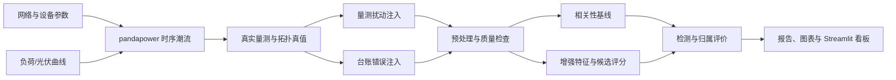

# 配电网线变关系智能校验项目设计规格

- 项目英文名：`distribution-network-line-transformer-verification`
- 项目中文名：基于时序量测与潮流仿真的配电网线变关系智能校验系统
- 文档状态：用户已于2026-08-15批准
- 目标用户：电气工程本科生、电网/能源数字化实习面试官、教学与科研复现实验使用者
- 第一版技术路线：`pandapower + NumPy + pandas + scikit-learn + Plotly + Streamlit`

## 1. 项目定位

### 1.1 业务问题

配电网线路改造、负荷迁移和台账维护不同步时，系统记录的“10 kV 馈线—配电变压器”从属关系可能与现场物理连接不一致。错误台账会影响线损分析、停电范围研判、负荷统计、故障定位和营配调数据贯通。

本项目利用同一馈线下配变电压与功率变化中包含的共同运行特征，对台账中的配变归属进行自动校验。系统不只输出“是否疑似错误”，还输出最可能的正确馈线、匹配分数和可解释证据。

### 1.2 简历价值

项目需要同时完成配电网建模、时序潮流、数据治理、异常检测、可解释算法、软件工程和交互展示，主要面向以下实习方向：

- 电网数字化与配网数据治理；
- 配电自动化、营配调贯通和线损分析；
- 智慧能源平台与电力数据分析；
- 电力系统仿真、状态感知和异常诊断；
- 能源软件研发与算法工程。

项目卖点应是“把电力机理转化成可复现的数据算法系统”，而不是单纯使用复杂 AI 模型。

## 2. 第一版目标与边界

### 2.1 必须实现

1. 建立包含上级电网、主变、3 条 10 kV 馈线和约 24 台配变的平衡配电网模型。
2. 生成30天、15分钟分辨率的负荷和光伏曲线，并执行交流时序潮流。
3. 输出配变电压、有功功率、无功功率及馈线量测数据。
4. 在不改变物理网络的前提下，生成包含错误归属的台账副本。
5. 实现原始电压相关性基线，以及包含差分、滚动窗口和事件匹配的增强方法。
6. 同时完成异常检测和正确馈线推荐。
7. 完成数据质量、潮流合理性、算法性能和鲁棒性实验。
8. 提供命令行流水线、自动化测试、中文 README 和 Streamlit 看板。

### 2.2 明确不纳入第一版

- 不使用真实电网内部或敏感数据；
- 不宣称可以直接上线替代现场核查；
- 不实现实时流处理、数据库和用户权限系统；
- 不使用 GNN、深度神经网络或大模型；
- 不在第一版处理三相不平衡、相别识别和户变关系；
- 不把 IEEE 14/30/118 母线潮流算例直接当作配变时序数据；
- 不预设或宣传未经实验得到的准确率。

### 2.3 后续扩展

- 接入 SimBench 网络与年度时序曲线进行跨网络验证；
- 使用 OpenDSS/IEEE 123 节点系统研究三相不平衡与调压设备；
- 引入馈线功率平衡、停电事件和开关状态等多源证据；
- 在数据与基线充分后，再评估图学习方法；
- 支持用户上传匿名化 CSV 数据离线校验。

## 3. 研究问题与预期贡献

| 编号 | 研究问题 | 贡献类型 | 必要证据 |
|---|---|---|---|
| RQ1 | 原始电压相关性是否足以区分同一母线下的不同馈线？ | 分析 | 基线实验、相关矩阵、误判案例 |
| RQ2 | 消除公共趋势并使用一阶差分后，能否提高线变错误识别能力？ | 算法 | 对比实验、消融实验、置信区间 |
| RQ3 | 噪声、缺失、采样错位和光伏反送如何影响结果？ | 鲁棒性 | 多扰动强度曲线、分场景指标 |
| RQ4 | 可解释的候选馈线评分能否兼顾异常检测和归属推荐？ | 系统 | F1、Top-1/Top-3、案例解释 |

第一版的核心贡献定位为：构建一个物理可解释、可复现、带错误注入和鲁棒性评估的线变关系校验基准流程。

## 4. 总体架构



系统划分为七个边界清晰的模块：

1. `network`：只负责构造网络、设备与物理连接。
2. `profiles`：只负责生成有时间索引的负荷和光伏曲线。
3. `simulation`：将曲线送入潮流计算并保存量测。
4. `corruption`：分别制造台账错误和量测质量问题。
5. `features`：生成候选“配变—馈线”特征，不接触测试真值。
6. `models`：完成基线评分、增强评分和可选监督模型。
7. `evaluation`：读取预测与真值，统一计算指标和图表。

模块之间通过有明确字段的数据表连接，避免把网络构造、算法和界面写在同一个脚本中。

## 5. 电力系统仿真设计

### 5.1 网络结构

默认网络包含：

- 110 kV 外部电网：平衡节点，提供电压参考；
- 1 台 110/10 kV 主变压器；
- 1 段 10 kV 母线；
- 3 条 10 kV 出线，每条馈线设置主干和分支线路；
- 每条馈线 8 台 10/0.4 kV 配电变压器；
- 每台配变低压侧设置一个聚合 PQ 负荷；
- 部分配变低压侧设置光伏 `sgen`，用于反送和净负荷变化场景。

线路长度、单位长度电阻电抗、变压器额定容量、短路电压和铜耗等参数均写入配置文件，并在 README 中说明参数来源与工程含义。

### 5.2 基准值与单位约定

- 仿真输入遵循 pandapower 的 kV、MW、Mvar、km 和 ohm/km 约定；
- 电压结果统一导出为标幺值 `voltage_pu`；
- 网络额定频率为 50 Hz；
- 正方向统一定义为上级电网向负荷供电；光伏反送时净有功允许为负；
- 外部电网作为平衡节点，聚合负荷作为 PQ 节点；
- 第一版使用平衡正序交流潮流，三相不平衡是明确的模型限制。

每次仿真必须检查潮流是否收敛、功率平衡是否合理、设备负载率是否越限，以及母线电压是否处于预期范围。越限数据不自动删除，而是标记原因并纳入场景说明。

### 5.3 时间序列

默认场景为30天、15分钟一个采样点，共 2880 个时刻。每台配变负荷由以下成分组成：

1. 全网共同的日周期和工作日/周末模式；
2. 馈线级共同扰动；
3. 配变级居民、商业或混合负荷差异；
4. 小幅随机扰动和少量负荷突变事件；
5. 可选的天气相关光伏曲线。

固定默认随机种子为 `42`。不同实验使用独立种子，并在结果表中保存种子、配置哈希和运行时间。

### 5.4 仿真合理性检查

- 默认场景所有时间点应完成潮流收敛；
- 常规工况电压目标范围为 0.90～1.10 p.u.；
- 每个时刻检查上级注入与线路、变压器、负荷及发电之间的功率平衡；
- 检查光伏高出力时段的功率方向；
- 检查同馈线配变不是完全相同曲线，且不同馈线仍共享上级电压公共分量；
- 保存不收敛、越限和缺失统计，禁止静默跳过。

## 6. 数据与标签设计

### 6.1 数据分层

| 数据层 | 作用 | 是否允许算法读取真值 |
|---|---|---|
| `truth_topology` | 保存真实物理连接 | 否，仅评价模块读取 |
| `reported_ledger` | 模拟业务台账 | 是 |
| `clean_measurements` | 潮流产生的干净量测 | 仅数据生成与对照实验 |
| `observed_measurements` | 加入噪声、缺失和错位后的量测 | 是，主算法输入 |
| `predictions` | 异常判断、推荐馈线及解释 | 评价和界面读取 |

### 6.2 核心表结构

`transformer_measurements.parquet`：

| 字段 | 类型 | 含义 |
|---|---|---|
| `timestamp` | datetime | 量测时间 |
| `transformer_id` | string | 配变唯一编号 |
| `voltage_pu` | float | 低压侧电压标幺值 |
| `p_mw` | float | 配变净有功功率 |
| `q_mvar` | float | 配变净无功功率 |
| `data_quality_flag` | string | 正常、缺失恢复、越限等标记 |

`reported_ledger.csv`：

| 字段 | 类型 | 含义 |
|---|---|---|
| `transformer_id` | string | 配变编号 |
| `reported_feeder_id` | string | 台账记录的馈线 |
| `transformer_capacity_kva` | float | 配变容量 |
| `customer_type` | string | 居民、商业或混合 |

`truth_topology.csv` 单独保存 `physical_feeder_id`，不得合并进模型特征表。

`feeder_measurements.parquet` 保存合法的馈线侧量测，字段包括 `timestamp`、`feeder_id`、`head_voltage_pu`、`p_mw` 和 `q_mvar`。这些量测可以参与候选馈线评分，但不能由 `truth_topology` 反向聚合生成，以免把真实归属泄漏给算法。

### 6.3 错误台账注入

错误只修改台账副本，不改变 pandapower 网络。默认随机选择 20% 配变，将其 `reported_feeder_id` 改为其他馈线，且保证错误馈线与真实馈线不同。

错误比例、交换策略和随机种子必须可配置。测试集的错误注入种子不得用于阈值选择。评价标签由 `reported_feeder_id != physical_feeder_id` 生成，但该标签仅供训练或评价阶段使用。

### 6.4 量测扰动

支持独立配置：

- 高斯测量噪声；
- 随机点缺失和连续块缺失；
- 单台设备时间戳偏移；
- 异常尖峰；
- 光伏渗透率和云量扰动；
- 负荷水平与功率因数变化。

默认主实验保留轻度噪声和 1% 随机缺失；鲁棒性实验逐级增加扰动。所有扰动参数必须随实验结果保存。

## 7. 算法设计

### 7.1 预处理

1. 校验时间戳、设备编号和重复记录；
2. 统一到15分钟网格；
3. 短缺口使用时间插值，长缺口保留缺失并降低覆盖度；
4. 使用物理范围检查标记异常，但不任意删除真实运行事件；
5. 计算全网或母线公共电压分量，并生成去公共趋势残差；
6. 保证任意一对曲线仅在共同有效时间点计算特征；
7. 有效覆盖不足时输出“数据不足”，不强行给出结论。

### 7.2 基线方法

对每台配变，使用其电压曲线与当前台账馈线中其他配变的群组中心曲线计算 Pearson 相关系数。群组中心使用逐时刻中位数，并在计算候选自身所属群组时排除候选本身，避免自相关导致分数虚高。

基线只使用原始电压相关性，通过验证集选择异常阈值。

### 7.3 增强候选馈线评分

对每个候选配变 `t` 和候选馈线 `f`，生成：

- 原始电压相关系数；
- 去公共趋势后相关系数；
- 电压一阶差分相关系数；
- 多个滚动窗口相关系数的中位数和低分位数；
- 电压突变事件匹配率；
- 有功/无功变化与馈线聚合变化的相关性；
- 有效数据覆盖率。

默认使用配置化加权评分：

`score(t, f) = Σ w_i × feature_i(t, f)`

权重只在训练/验证场景确定，测试场景不得参与。项目必须包含权重敏感性分析，证明结果不是由某一个任意权重单独决定。

### 7.4 判定与推荐

- 当前台账匹配分：`score_current`；
- 最优其他馈线匹配分：`score_best`；
- 分数间隔：`margin = score_best - score_current`。

只有同时满足当前匹配分低、候选匹配分足够高、分数间隔超过阈值且有效覆盖充分时，才判为疑似错误。系统输出：

- `predicted_is_mislinked`；
- `recommended_feeder_id`；
- `confidence`；
- 各特征贡献；
- 数据覆盖与质量提示。

不满足证据要求时输出“需人工复核”，而不是制造高置信结论。

### 7.5 可选监督学习对照

第二阶段可以用随机森林对候选“配变—馈线”对分类。特征仍来自可解释特征层，不允许直接使用物理馈线编号、样本序号或错误注入参数。

Isolation Forest 仅作为异常检测对照，不承担正确馈线推荐。GNN、DTW 和端到端深度学习不属于第一版范围。

## 8. 实验设计

### 8.1 数据划分

禁止随机打散所有时间点后划分训练集和测试集。采用按仿真场景、日期块和随机种子分组的划分方式：

- 训练/阈值标定：60%；
- 验证/权重选择：20%；
- 最终测试：20%。

同一个基础时序场景及其扰动版本只能出现在一个集合中，防止数据泄漏。

### 8.2 核心实验

| 实验 | 自变量 | 主要输出 |
|---|---|---|
| E0 物理与数据检查 | 无错误台账 | 潮流收敛率、电压范围、假阳性率 |
| E1 方法对比 | Pearson、增强评分、随机森林 | Precision、Recall、F1、Top-1 |
| E2 错误率 | 5%、10%、20%、30% | 指标随错误率变化 |
| E3 噪声 | 多级电压噪声 | 鲁棒性曲线 |
| E4 缺失 | 点缺失、块缺失 | F1、覆盖率、拒判率 |
| E5 时间错位 | 0～多个采样点 | 性能衰减曲线 |
| E6 光伏 | 不同渗透率和天气扰动 | 分场景指标 |
| E7 泛化 | 新日期、新随机种子、新负荷水平 | 测试集指标 |
| E8 消融 | 逐项移除差分、滚动、事件、功率特征 | 各特征贡献 |
| E9 阈值敏感性 | 异常阈值和分数间隔 | PR 曲线、推荐覆盖率 |

### 8.3 指标

异常检测：Precision、Recall、F1、PR-AUC、混淆矩阵、假阳性率。

归属推荐：Top-1、Top-3、仅对真实错误样本的修正成功率。

工程指标：潮流收敛率、数据覆盖率、拒判率、单次运行时间、峰值内存。

所有指标同时报告样本数量和不同随机种子的均值与标准差。类别不平衡时不以 Accuracy 作为主指标。

### 8.4 验收标准

工程验收：

- 默认配置可以从零生成数据、训练/标定、评价并启动看板；
- 默认场景潮流收敛率为 100%，否则必须明确失败时刻与原因；
- 相同配置和随机种子重复运行得到一致结果；
- 测试能阻止真值字段进入特征矩阵；
- 数据不足、不收敛和文件字段错误均有清晰提示。

研究目标而非预设结论：

- 在默认干净测试场景争取达到 F1 ≥ 0.85；
- 增强方法应在多数扰动场景优于原始 Pearson 基线；
- 若未达到目标，应如实展示失败场景和原因，不调整测试集来美化结果。

## 9. 可视化看板

### 9.1 页面

1. **项目总览**：网络规模、错误台账比例、告警数量和总体指标。
2. **网络拓扑**：按馈线着色，区分台账归属与推荐归属。
3. **配变诊断**：选择单台配变，查看原始/差分电压、候选馈线分数和解释。
4. **相似度矩阵**：展示配变之间的群组结构和疑似离群点。
5. **模型评估**：混淆矩阵、PR 曲线、Top-k 指标和方法对比。
6. **鲁棒性实验**：展示噪声、缺失、错位和光伏条件下的性能变化。

### 9.2 交互原则

- 页面默认读取已有实验产物，不在每次刷新时重新执行全部潮流；
- 所有图表注明数据场景、方法和阈值；
- 置信度旁显示覆盖率和关键证据；
- “物理真值”仅在演示/评价模式显示，模拟真实业务模式时隐藏；
- 错误或缺失文件给出可执行的修复提示。

## 10. 仓库结构

```text
distribution-network-line-transformer-verification/
├── README.md
├── LICENSE
├── pyproject.toml
├── requirements.txt
├── .gitignore
├── configs/
│   ├── default.yaml
│   ├── robustness.yaml
│   └── simbench.yaml
├── data/
│   ├── README.md
│   ├── raw/
│   ├── interim/
│   └── processed/
├── src/
│   └── ltverify/
│       ├── __init__.py
│       ├── config.py
│       ├── network.py
│       ├── profiles.py
│       ├── simulation.py
│       ├── validation.py
│       ├── corruption.py
│       ├── preprocessing.py
│       ├── features.py
│       ├── scoring.py
│       ├── evaluation.py
│       ├── plotting.py
│       └── cli.py
├── app/
│   ├── streamlit_app.py
│   └── pages/
├── notebooks/
│   ├── 01_network_sanity.ipynb
│   ├── 02_baseline_analysis.ipynb
│   └── 03_robustness_analysis.ipynb
├── tests/
│   ├── unit/
│   ├── integration/
│   └── fixtures/
├── reports/
│   ├── figures/
│   └── metrics/
├── scripts/
│   ├── run_pipeline.ps1
│   └── run_dashboard.ps1
└── docs/
    ├── methodology.md
    ├── interview-guide.md
    └── superpowers/specs/
```

生成的大型数据和模型产物默认不提交 Git；仓库保留小型示例数据、生成配置和数据字典，确保任何人可以复现。

## 11. 命令与数据流接口

计划提供以下统一入口：

```text
python -m ltverify simulate --config configs/default.yaml
python -m ltverify corrupt --config configs/default.yaml
python -m ltverify diagnose --config configs/default.yaml
python -m ltverify evaluate --config configs/default.yaml
python -m ltverify run-all --config configs/default.yaml
streamlit run app/streamlit_app.py
```

每一步写出机器可读的运行清单 `manifest.json`，包括配置路径、随机种子、输入输出、版本、时间和状态。下游步骤先校验清单与字段，再执行计算。

## 12. 错误处理与质量保障

### 12.1 运行错误

- 潮流不收敛：记录时间点、负荷倍率和异常设备，停止默认流水线；
- 输入字段缺失：列出缺失字段和期望模式；
- 时间索引异常：拒绝重复或非单调时间序列；
- 有效重叠不足：输出数据不足并拒绝高置信诊断；
- 未知设备或馈线：停止处理，防止静默丢失记录；
- 输出目录冲突：默认使用带时间和配置哈希的运行目录。

### 12.2 测试层次

单元测试：负荷曲线、错误注入、插值、相关特征、评分和指标。

集成测试：使用小型3馈线网络执行短时序全流水线。

科学正确性测试：功率平衡、电压范围、光伏功率方向、配变与馈线映射唯一性。

防泄漏测试：特征表不得出现 `physical_feeder_id`、`is_mislinked` 或错误注入种子。

可复现测试：相同种子产生相同台账错误、曲线和指标。

界面冒烟测试：示例产物可被 Streamlit 页面加载，关键页面不报错。

## 13. 分阶段执行框架

### 阶段0：环境与项目骨架

学习重点：虚拟环境、Git、Python 包结构、配置文件和 pytest。

交付：仓库结构、依赖、最小命令、测试框架和 README 骨架。

### 阶段1：电网模型与潮流校验

学习重点：pandapower 元件、平衡节点、PQ 节点、标幺值、潮流收敛和功率平衡。

交付：静态网络、拓扑图、单时刻潮流和合理性报告。

### 阶段2：时序数据与错误台账

学习重点：负荷曲线、光伏净负荷、时间索引、数据质量和标签构造。

交付：30天量测、真值拓扑、错误台账和数据字典。

### 阶段3：相关性基线

学习重点：Pearson/Spearman、群组中心、阈值、类别不平衡和数据划分。

交付：相似度矩阵、基线预测、混淆矩阵和误判分析。

### 阶段4：增强算法与鲁棒性

学习重点：差分、滚动统计、事件检测、候选评分、消融和敏感性分析。

交付：增强模型、方法对比、九组实验和完整结果表。

### 阶段5：系统展示与求职材料

学习重点：Streamlit、Plotly、可解释展示、技术写作和面试叙事。

交付：看板、演示视频脚本、中文 README、技术报告和面试问答。

只有当前阶段达到验收条件后才进入下一阶段；每阶段保留可运行版本，不进行一次性大爆炸开发。

## 14. 求职交付标准

GitHub 首页应让面试官在两分钟内看懂：业务痛点、系统方法、仿真网络、实验结论、运行方式和限制。

在实验完成前，简历只能采用不包含性能数字的事实描述：

> 基于 pandapower 构建多馈线时序潮流仿真与错误台账基准；设计公共趋势消除、差分相关和事件匹配的可解释校验算法，并使用 Streamlit 实现异常定位与正确馈线推荐看板。

实验完成后，才在简历中补充由固定命令可复现的配变数量、测试场景、基线 F1 和增强方法 F1。

面试演示顺序：

1. 用30秒解释线变关系错误为什么影响业务；
2. 用30秒解释真实拓扑、错误台账和量测数据如何生成；
3. 用60秒展示 Pearson 的局限和增强方法；
4. 用60秒演示看板中的一条异常及推荐证据；
5. 主动说明仿真数据、平衡模型和无法直接上线等限制。

## 15. 风险与应对

| 风险 | 后果 | 应对 |
|---|---|---|
| 不同馈线电压过于相似 | 原始相关性无法区分 | 增加合理线路阻抗和馈线级负荷差异；去除公共趋势；报告失败边界 |
| 合成曲线过于简单 | 指标虚高 | 加入多类型负荷、突变、光伏、噪声、缺失和新场景测试 |
| 真实馈线字段泄漏 | 得到虚假高分 | 真值表物理隔离；增加自动防泄漏测试 |
| 随机时间点划分 | 训练测试高度重复 | 按日期块、场景和种子分组划分 |
| 只报告 Accuracy | 掩盖类别不平衡 | 以 Precision、Recall、F1、PR-AUC 和 Top-k 为主 |
| 阈值只适合单一网络 | 泛化能力差 | 保存阈值来源；开展新负荷、种子和 SimBench 扩展实验 |
| 潮流参数不合理 | 数据缺乏物理意义 | 参数来源记录、收敛检查、功率平衡和电压范围检查 |
| 过早使用复杂模型 | 难解释、难调试 | 第一版冻结为可解释统计特征与传统机器学习 |

## 16. 完成定义

第一版只有在以下条件全部满足时才算完成：

- 新环境可按 README 从零安装并运行；
- 默认流水线可自动产生网络、时序量测、错误台账、预测和评价；
- 所有测试通过，且不存在真值泄漏；
- 潮流、单位和功率方向检查有记录；
- 至少包含一个基线、一个增强方法、一个消融实验和四类鲁棒性实验；
- 看板可以解释具体配变为何告警以及推荐到哪条馈线；
- README 清楚区分已完成结果、目标指标和项目限制；
- 简历中的所有数字均可由仓库命令复现。
