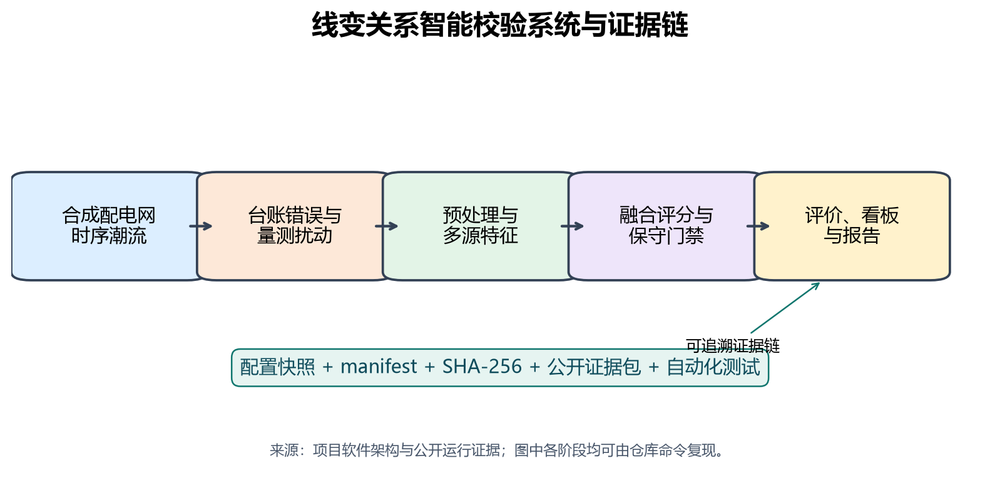
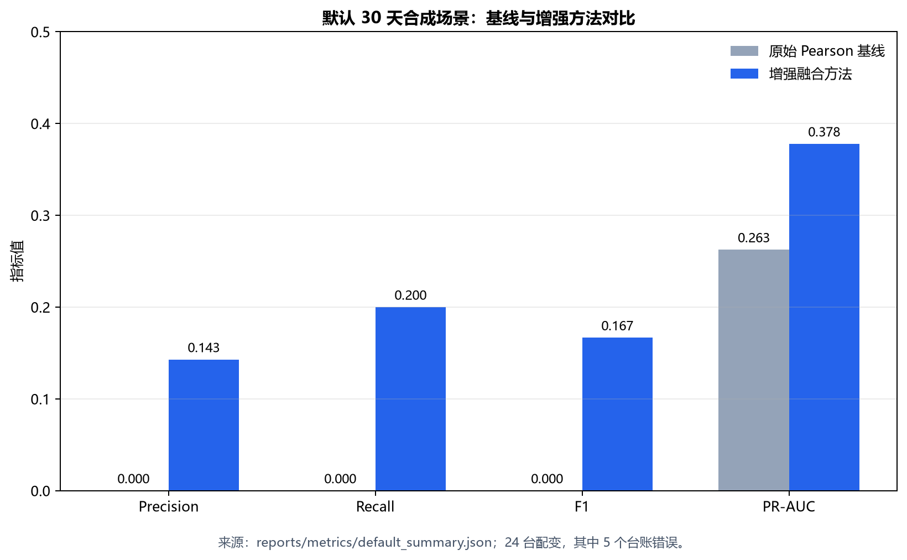
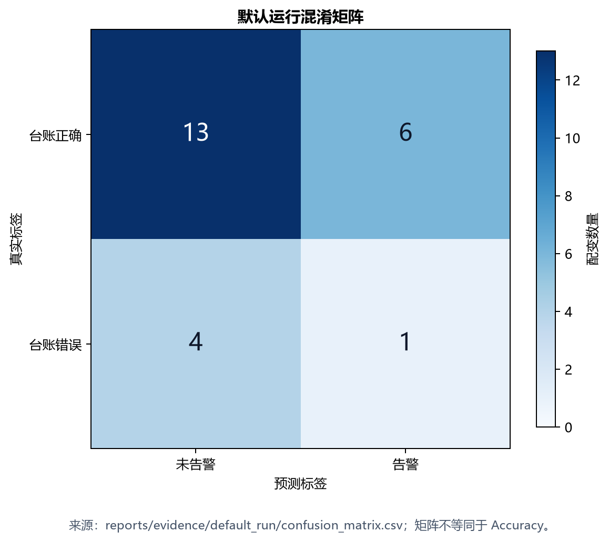
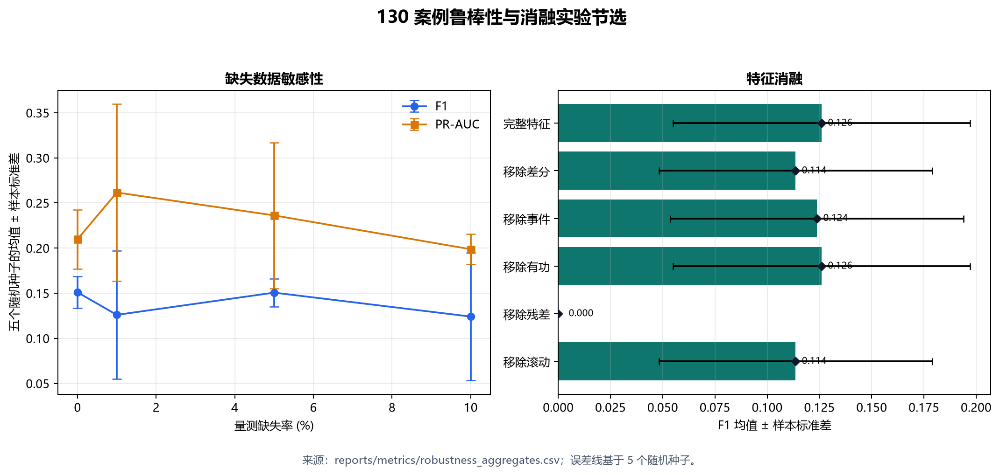

# 基于多源时序特征与可复现证据链的配电网线变关系智能校验

**作者：电气工程本科项目**<br>
**项目类型：电网/能源数字化研究型软件原型**<br>
**版本：0.1.0（2026 年 8 月）**

## 摘要

配电网线路改造、负荷迁移和台账维护不同步可能导致“10 kV 馈线—配电变压器”从属关系与物理连接不一致，进而影响线损分析、停电范围研判、负荷统计和营配调数据贯通。针对本科项目难以获得真实电网敏感数据、公开结果又常缺少完整复现证据的问题，本文设计并实现了一套基于合成时序潮流、多源可解释特征和完整性清单的线变关系智能校验原型。系统使用 pandapower 构造 110/10/0.4 kV 平衡正序网络，生成 30 天、15 分钟分辨率的电压和有功功率量测；台账错误仅注入台账副本，物理拓扑真值严格隔离于评价阶段。方法在原始电压 Pearson 相关基线之上，融合去公共趋势残差相关、一阶差分相关、滚动相关、电压事件 Jaccard 匹配和有功功率相关，并通过覆盖率、当前匹配分和候选间隔门禁输出自动推荐、人工复核、无变化或数据不足。

默认公开运行包含 24 台配变和 5 个实际台账错误。增强方法的 Precision、Recall、F1 和 PR-AUC 分别为 0.143、0.200、0.167 和 0.378，Top-1/Top-2 修正率为 0.200/0.400；原始 Pearson 基线不触发告警，F1 为 0.000。结果表明增强方法虽优于检测基线，但性能仍明显不足。进一步分析发现同馈线残差相关均值为 -0.064，跨馈线均值为 0.009，未形成期望的方向性差异。本文没有隐藏该负面结果，而是结合 130 个鲁棒性与消融案例刻画失效边界。工程上，系统使用配置快照、schema-v2 manifest、SHA-256、公开证据包、规范报告和自动化测试形成可核查闭环。本文结论只适用于合成场景，不代表真实电网现场效果。

**关键词：** 配电网；线变关系；拓扑校验；时序相关性；异常检测；pandapower；可复现研究

## 1 引言

### 1.1 研究背景

配电网资产台账描述设备、线路和用户之间的逻辑关系，是线损、停电管理、负荷预测、状态估计和故障处置的基础。现场开关操作、线路切改和负荷迁移发生后，如果信息系统未同步维护，台账关系可能滞后。传统人工排查依赖现场经验、停电核对或逐条档案复核，成本高且难以持续覆盖。

智能电表和配变终端提供了另一条路径：相近电气位置受到相似上游电压波动影响，其电压曲线可能具有统计相关性。Watson 等利用智能电表数据讨论了变压器和相别归属识别，并指出相关性方法在噪声与缺失条件下需要增强 [@Watson2016]。利用智能电表与微型同步相量测量单元联合辨识拓扑和参数，也说明量测数据可以弥补网络模型信息不完整 [@Srinivas2022]。针对低压网络，相关系数和相似性度量已被用于连接关系核查 [@Tong2022]。这些研究为“从时序量测反推台账关系”提供了依据。

### 1.2 问题与现实约束

学生项目面临三个直接约束。第一，真实电网数据具有敏感性，公开获得设备级连续量测和物理真值很困难。第二，简单地宣称“同线路相关系数大于 0.9”容易忽略公共母线趋势、配变自身阻抗压降、光伏反送、量测噪声与时间错位。已有研究表明，分布式电源的相关注入会影响数据驱动拓扑判断 [@Chen2022]；有限量测条件下还需要同时考虑数据质量、时间分辨率和参数不确定性 [@DeJongh2025]。第三，单个 Notebook 或一张准确率截图无法说明数据是否泄漏、结果是否被篡改以及他人能否复现。

### 1.3 本文工作

本文不把问题包装为已经解决的现场应用，而是构建一套可运行、可解释、可审计的工程原型。主要工作如下：

1. 建立 110/10/0.4 kV 合成配电网和 30 天时序潮流，分离物理真值、台账副本和受扰量测；
2. 实现原始相关基线及残差、差分、滚动、事件、有功多源融合评分；
3. 设计覆盖率和候选间隔门禁，使证据不足时可以拒绝自动判断；
4. 以 130 个多随机种子案例检验台账错误率、噪声、缺失、时移、光伏和特征消融；
5. 用配置快照、manifest、SHA-256、规范报告和公开证据包构成从数值到代码提交的追溯链。

图 1 给出完整系统和证据链。



## 2 问题定义

### 2.1 校验对象

设配变集合为 $\mathcal{T}=\{1,\ldots,N\}$，候选馈线集合为 $\mathcal{F}=\{1,\ldots,K\}$。对配变 $i$，台账记录馈线为 $f_i^{(r)}$，物理馈线真值为 $f_i^{(p)}$。台账错误标签定义为：

$$
y_i=\mathbb{I}\left(f_i^{(r)}\neq f_i^{(p)}\right).
$$

模型不能访问 $f_i^{(p)}$ 或 $y_i$。它只能使用受扰量测、当前台账分组和候选馈线量测，输出异常分数 $a_i$、推荐馈线 $\hat f_i$、置信度和判定状态。

### 2.2 双重任务

该问题包含两个不同目标：

1. **错误检测**：判断当前台账是否可能错误，评价 Precision、Recall、F1 和 PR-AUC；
2. **归属修正**：对实际错误设备排序候选馈线，评价 Top-1 和 Top-2 修正率。

检测正确并不意味着推荐馈线正确，因此不能只报告一个“准确率”。对于样本不平衡的异常检测，Precision-Recall 曲线比单独的 ROC 或 Accuracy 更能反映少数类表现 [@Davis2006]；PR 图在不平衡数据上的解释优势也得到系统讨论 [@Saito2015]。

### 2.3 泄漏防护

物理字段 `physical_feeder_id` 和 `is_mislinked` 只保存在真值表并进入评价函数。台账错误注入只改写 `reported_ledger.csv`，不改变 pandapower 网络或原始物理量测。测试会扫描特征列、候选评分和模型接口，拒绝真值字段进入模型。演示评价模式可以显示真值，但普通看板默认关闭该模式。

## 3 数据与系统

### 3.1 合成网络

默认网络由 110 kV 外部电网、110/10 kV 主变、3 条 10 kV 馈线以及每条馈线 8 台 10/0.4 kV 配变组成，共 24 台配变。系统使用 pandapower 建模和执行平衡正序交流潮流；pandapower 的数据结构和自动化能力适合静态及准静态电力系统分析 [@Thurner2018]。

每台配变连接负荷，部分节点连接光伏。配置给定功率因数、负荷曲线、光伏尺度、线路与变压器参数。默认时段从 2026-01-01 00:00 开始，共 30 天，间隔 15 分钟，即 2880 个时刻，随机种子为 42。

### 3.2 时序潮流与物理门禁

每个时刻执行潮流并记录：

- 是否收敛；
- 最低和最高电压；
- 最大变压器负载率；
- 系统功率平衡误差；
- 电压越限、变压器过载和功率不平衡计数。

默认配置要求电压位于 0.9--1.1 p.u.，最大变压器负载率不超过 100%，功率平衡误差不超过 $10^{-6}$ MW。不收敛始终作为硬失败；配置中的严重物理违规默认零容忍，避免用不可行潮流训练或评价算法。

### 3.3 台账错误与量测扰动

默认台账错误率为 20%。错误注入为选中配变分配一个不同的台账馈线，物理网络不变。量测侧独立加入：

- 电压高斯噪声，默认标准差 0.0005 p.u.；
- 1% 随机缺失和有限长度插值；
- 稀疏尖峰；
- 部分设备时间错位；
- 可配置光伏尺度。

这种设计使物理事实、信息系统台账和采集数据质量成为三个独立层。异步配变监测数据上的拓扑识别研究同样说明，时间不同步是实际算法必须处理的因素 [@Xu2023]。

### 3.4 数据产物

流水线输出网络节点、线路、物理真值、台账副本、原始和受扰量测、候选特征、预测、混淆矩阵、指标及逐时刻物理校验。所有输出由 `manifest.json` 声明，运行配置另存为 `config.snapshot.yaml`。

## 4 方法

### 4.1 时间对齐与覆盖率

量测先投影到固定 15 分钟网格。短缺口允许时间插值，长缺口保留为空。配变 $i$ 与候选馈线 $f$ 的覆盖率定义为共同有限样本占目标时间网格的比例。共同样本数低于 `minimum_pairs` 或覆盖率低于 `minimum_coverage` 时，不输出强制结论。

### 4.2 标准化与公共趋势消除

对序列 $x_{i,t}$ 使用 Z-score：

$$
z_{i,t}=\frac{x_{i,t}-\mu_i}{\sigma_i}.
$$

但原始电压包含全网共同趋势。为突出局部差异，在每个时刻计算配变电压中位数 $m_t$，构造残差：

$$
e_{i,t}=v_{i,t}-m_t.
$$

同时计算一阶差分 $\Delta v_{i,t}=v_{i,t}-v_{i,t-1}$，减弱缓慢漂移并强调同步变化。

### 4.3 Pearson 相关基线

对具有共同有效时刻的序列 $x$ 和 $y$，Pearson 相关系数为：

$$
r_{xy}=\frac{\sum_t(x_t-\bar{x})(y_t-\bar{y})}
{\sqrt{\sum_t(x_t-\bar{x})^2}\sqrt{\sum_t(y_t-\bar{y})^2}}.
$$

基线仅使用原始电压相关和台账分组中心。计算候选馈线群组中心时始终排除目标配变本身，防止自相关把当前台账馈线分数人为推高。

### 4.4 多源特征

增强方法为每个配变—候选馈线对计算七类证据：

1. 原始电压相关；
2. 去公共趋势残差相关；
3. 一阶差分相关；
4. 滚动相关中位数；
5. 滚动相关低分位数；
6. 高变化事件集合的 Jaccard 相似度；
7. 有功功率相关。

事件集合由差分绝对值的高分位阈值确定。若配变事件集合为 $A$、候选馈线事件集合为 $B$，则：

$$
J(A,B)=\frac{|A\cap B|}{|A\cup B|}.
$$

仅有限且通过质量检查的特征参与加权。加权分数写为：

$$
S(i,f)=\frac{\sum_{j\in\mathcal{V}_{i,f}}w_j s_j(i,f)}
{\sum_{j\in\mathcal{V}_{i,f}}w_j},
$$

其中 $\mathcal{V}_{i,f}$ 为有效证据集合，$w_j$ 为配置中预先固定的启发式权重。该权重尚未由独立真实数据集标定。

### 4.5 保守判定与推荐

令当前台账馈线分数为 $S_c=S(i,f_i^{(r)})$，最高候选分数为 $S_1$，第二名为 $S_2$，候选间隔为 $M=S_1-S_2$。默认配置中的主要门禁包括：

- `current_score_threshold = 0.70`；
- `margin_threshold = 0.08`；
- `minimum_coverage = 0.80`；
- `minimum_pairs = 16`。

只有在覆盖率充分、当前匹配分偏低且候选间隔充分时，系统才输出 `automatic_recommendation`。证据提示异常但间隔不足时输出 `review_required`；无充分异常证据时输出 `no_change`；覆盖率不足时输出 `insufficient_data`。

异常分数基于当前匹配不足和候选优势构造，用于 PR-AUC 排序。所有 NaN 或无穷候选均从 Top-k 排名中排除并计数，避免非法数值通过排序规则获得推荐。

## 5 软件实现

### 5.1 模块划分

项目使用 Python 3.11/3.12，主要模块包括：

- `network.py`：合成电网和资产表；
- `profiles.py`：负荷与光伏曲线；
- `simulation.py`：时序潮流；
- `validation.py`：物理约束；
- `corruption.py`：台账和量测扰动；
- `preprocessing.py`：对齐、插值、残差与差分；
- `features.py`：候选特征；
- `scoring.py`：融合评分和门禁；
- `evaluation.py`：检测、排序和 PR 指标；
- `pipeline.py`：端到端编排；
- `manifest.py`、`data_access.py`：产物声明、校验和安全加载；
- `app/`：中英文 Streamlit 多页看板。

### 5.2 可视化与本地化

看板包含网络拓扑、配变诊断、相似度矩阵、模型评估和鲁棒性实验五页。界面默认简体中文，可切换英文。翻译只发生在展示副本，T001、F01、kV、p.u.、PR-AUC 和 SHA-256 等技术标识不翻译，算法字段及证据哈希不因界面语言改变。

### 5.3 证据链

每次运行从 `running` 状态开始，成功后写入 `completed` manifest；失败时保留结构化 `failure_summary`。manifest 精确声明输出文件与 SHA-256，并把配置快照纳入哈希闭环。报告命令先校验后解析。公开证据包保存一份权威 30 天运行，使新 clone 可以在不重新仿真的情况下逐字节复现规范摘要。

SHA-256 只用于完整性检查，不是数字签名。若攻击者能同时改写产物和同目录清单，单靠哈希不能证明来源身份。

## 6 实验设置

### 6.1 默认实验

默认实验固定随机种子 42，包含 24 台配变，台账错误率 20%，实际错误数为 5。量测噪声标准差为 0.0005 p.u.，缺失率为 1%，光伏尺度为 1.0。所有算法权重与阈值在运行前由配置固定，测试场景不参与参数选择。

### 6.2 评价指标

错误检测报告 Precision、Recall、F1 和连续异常分数 PR-AUC。归属修正报告 Top-1 与 Top-2 修正率，并同时报告评价覆盖率。自动推荐覆盖率与数据不足率用于刻画系统选择性。PR-AUC 仅在真值同时含正负样本时适用；单类别案例记为 null，而不是 0。

### 6.3 鲁棒性和消融

鲁棒性矩阵包括五个实验族：台账错误率、量测噪声、缺失率、时间错位步数和光伏尺度。每个族包含 4 个水平、5 个随机种子，共 100 个案例。消融包含完整特征及分别移除残差、差分、滚动、事件和有功特征的 6 个版本，每个版本 5 个随机种子，共 30 个案例。合计 130 个案例。

每个案例除算法指标外还记录收敛率、电压范围、最大变压器负载率、功率平衡误差和物理违规计数。实验清单保存实验配置、基础配置、输出哈希、案例计数和软件版本。

## 7 实验结果

### 7.1 默认运行物理有效性

默认 base-case 收敛，电压范围为 1.0000--1.0001 p.u.，功率平衡误差约 $7.46\times10^{-14}$ MW。时序运行 2880/2880 时刻收敛，电压范围为 0.9643--1.0000 p.u.，最大变压器负载率为 53.94%，最大功率平衡误差为 $2.67\times10^{-8}$ MW；全部时刻 `severity=ok`。这些结果证明合成潮流满足当前配置的工程门槛，但不证明模型具有真实电网代表性。

### 7.2 检测与修正结果

表 1 为默认权威运行结果。数值直接来自 `reports/metrics/default_summary.json`。

| 指标 | 原始 Pearson 基线 | 增强融合方法 |
|---|---:|---:|
| Precision | 0.000 | 0.143 |
| Recall | 0.000 | 0.200 |
| F1 | 0.000 | 0.167 |
| PR-AUC | 0.263 | 0.378 |
| Top-1 修正率 | 0.200 | 0.200 |
| Top-2 修正率 | 0.400 | 0.400 |
| 自动推荐覆盖率 | - | 0.292 |



增强方法预测 7 个告警，其中 1 个是真阳性、6 个是假阳性；5 个实际错误中漏检 4 个。混淆矩阵如图 3。增强方法相对“完全不告警”的基线提高了检测 F1 和 PR-AUC，但绝对性能仍低，不能作为自动修改台账的依据。



### 7.3 机会基线解释

候选馈线只有 3 条。若对三个候选均匀随机排序，Top-1 和 Top-2 的描述性期望分别约为 1/3 和 2/3。默认场景仅有 5 个实际错误，增强方法 Top-1=0.200、Top-2=0.400，均未超过上述机会参照。由于 $n=5$ 很小，本文不进行显著性推断，只把这一比较作为风险提示。

### 7.4 相关性失效边界

公开摘要中的 `same_feeder_residual_corr_mean` 为 -0.0637，`cross_feeder_residual_corr_mean` 为 0.00875，对应样本对数量为 84 和 192。同馈线相关性不但没有高于跨馈线，还出现轻微负值。诊断表明，默认网络中的馈线级共享电压分量约为 $2\times10^{-4}$ p.u.，小于配变自身阻抗压降约 $4\times10^{-3}$ p.u. 及量测噪声 0.0005 p.u.。去除公共趋势后，可用于区分馈线的共享信号进一步减弱。

这说明“同线路电压相关系数通常高于 0.9”不能被当作普适规则。线路阻抗、负荷同步性、公共母线影响、采样精度和分布式电源共同决定可辨识性。

## 8 鲁棒性与消融

### 8.1 案例完整性

130 个计划案例全部完成，失败数为 0，所有聚合组的平均潮流收敛率为 1.0。该事实说明实验执行链稳定，不等于算法性能良好。

### 8.2 缺失、噪声、时移与光伏

图 4 左侧给出缺失率实验。缺失率从 0 增至 10% 时，五种子平均 F1 从 0.151 变化到 0.124，PR-AUC 从 0.210 变化到 0.199；由于各随机种子样本量小且标准差较大，曲线并非单调。噪声标准差提高到 0.002 p.u. 时，平均 F1 降至 0.081，自动推荐覆盖率降至 0.208，说明较强噪声会削弱有效证据。

0--4 个采样步的时间错位下，平均 F1 约为 0.124--0.126，变化不大。这不是算法已经解决任意异步问题，而是当前配置只有部分设备错位且整体信号可分性本来就弱。光伏尺度从 0 提高到 4 时，平均 F1 从 0.145 变化到 0.198，仍伴随较大种子间波动，不能据此宣称光伏必然改善识别。

### 8.3 台账错误率

当错误率为 5% 和 10% 时，平均 F1 都是 0；错误率提高到 20% 和 30% 时，平均 F1 分别为 0.126 和 0.273。原因之一是正类数量增加后检测指标更稳定，且 PR-AUC 的随机基准随正类比例变化。因此不同错误率下的 PR-AUC 不应脱离正类占比直接横向比较。

### 8.4 特征消融

图 4 右侧显示，完整特征的平均 F1 为 0.126；移除差分或滚动特征后为 0.114，移除事件后为 0.124，移除有功特征后仍为 0.126。移除残差特征后，自动推荐覆盖率变为 0，F1 为 0.000。残差特征对当前门禁触发具有关键作用，但完整模型本身表现较弱，因此这一结果只能说明当前实现的依赖性，不能证明残差特征在真实网络中具有普适优势。



## 9 讨论与局限

### 9.1 工程贡献与算法表现应分开评价

本项目的软件链路已经覆盖数据生成、物理检查、特征、评分、实验、证据、测试和看板，适合展示电气工程与软件工程交叉能力。但默认 F1=0.167 和 Top-k 低于机会参照意味着算法尚不具备生产使用价值。工程完整性不能替代模型有效性，反之，单个高指标也不能替代可复现性。

### 9.2 合成网络局限

当前模型采用平衡正序潮流，未模拟三相不平衡、相别错误、通信链路、仪表量化、真实负荷行为和开关操作。全部结论来自合成数据，不代表真实电网。未来应在获得合规数据后进行跨台区、跨季节和跨设备类型的外部验证，并在数据脱敏和权限管理框架内开展。

### 9.3 参数和统计局限

权重与阈值是预先固定的启发式参数，尚无独立验证集标定。默认正类只有 5 台，导致 F1、Top-k 和混淆矩阵对单台设备非常敏感。130 案例实验提供多种子均值和样本标准差，但没有建立置信区间、统计检验或独立网络拓扑泛化实验。

### 9.4 后续方法

动态时间规整能够处理序列局部时间伸缩 [@Sakoe1978]，Isolation Forest 通过随机隔离路径识别少数异常 [@Liu2008]；二者在本项目中尚未实现，不能被描述为当前算法。更优先的下一步不是盲目增加模型复杂度，而是提高馈线级可辨识信号：重新标定线路阻抗和负荷差异，构造多种网络拓扑，使用分组训练/验证/测试划分，再比较 DTW、树模型、图模型和当前可解释基线。

## 10 结论

本文完成了一套面向配电网线变关系校验的可复现研究型原型。系统将潮流仿真、台账错误、量测扰动、多源时序特征、保守门禁、候选排序、鲁棒性实验和中英文看板集成到统一 Python 工程，并用配置快照、manifest、SHA-256 和公开证据包约束结果来源。

默认场景中增强方法相对原始 Pearson 检测基线有所改善，但 F1 仅为 0.167、PR-AUC 为 0.378，Top-1/Top-2 修正率为 0.200/0.400。根因分析显示同馈线与跨馈线残差相关性没有形成预期分离。本文据此把“相关性在何种物理与数据条件下失效”作为核心结论之一，而不是删除负面结果。

对于本科实习项目，这套工作证明了从电力问题定义、数据契约、算法实现到测试、证据和产品化展示的完整能力。其下一阶段应以真实但合规的数据验证、网络多样性和独立参数标定为中心，而不是宣称已经达到现场自动校验水平。

## 11 复现声明

代码、配置、测试、规范指标和一份历史权威运行证据均随仓库公开。默认摘要可通过以下命令从公开证据包生成：

```text
python -m ltverify report \
  --run-dir reports/evidence/default_run \
  --output <临时目录>/default_summary.json \
  --manifest-output <临时目录>/default_manifest.json
```

输出应与 `reports/metrics/default_summary.json` 和 `reports/metrics/default_manifest.json` 逐字节一致。重新运行 `configs/default.yaml` 会生成新的 run ID、时间戳和提交信息，其语义是“重新执行实验”，不是复刻历史运行字节。

鲁棒性结果由 `configs/robustness.yaml` 定义，清单 `reports/metrics/robustness_experiment_manifest.json` 同时记录实验配置与基础配置的名称、哈希和快照。严格核验需提供两份当前源 YAML。

论文图由 `scripts/generate_paper_figures.py` 从权威结果生成。论文 PDF 由 `scripts/build_paper.py` 构建。软件和论文均采用 MIT 许可证；合成证据不含真实电网敏感信息。

## 参考文献

1. Watson, J. D., Welch, J., & Watson, N. R. Use of Smart-Meter Data to Determine Distribution System Topology. *The Journal of Engineering*, 2016(5), 94--101, 2016. DOI: 10.1049/joe.2016.0033.
2. Thurner, L., et al. pandapower---An Open-Source Python Tool for Convenient Modeling, Analysis, and Optimization of Electric Power Systems. *IEEE Transactions on Power Systems*, 33(6), 6510--6521, 2018. DOI: 10.1109/TPWRS.2018.2829021.
3. Xu, Z., et al. Distribution Network Topology Identification Using Asynchronous Transformer Monitoring Data. *IEEE Transactions on Industry Applications*, 59(1), 323--331, 2023. DOI: 10.1109/TIA.2022.3212030.
4. de Jongh, S., et al. Data-Driven Topology and Parameter Identification in Distribution Systems With Limited Measurements. *IEEE Transactions on Power Delivery*, 40(1), 249--260, 2025. DOI: 10.1109/TPWRD.2024.3491912.
5. Srinivas, V. L., & Wu, J. Topology and Parameter Identification of Distribution Network Using Smart Meter and Micro-PMU Measurements. *IEEE Transactions on Instrumentation and Measurement*, 71, 1--14, 2022. DOI: 10.1109/TIM.2022.3175043.
6. Tong, L., Chai, W., & Wu, D. Topology and Impedance Identification Method of Low-Voltage Distribution Network Based on Smart Meter Measurements. *Frontiers in Energy Research*, 10, 895397, 2022. DOI: 10.3389/fenrg.2022.895397.
7. Chen, J., Xu, X., Yan, Z., & Wang, H. Data-Driven Distribution Network Topology Identification Considering Correlated Generation Power of Distributed Energy Resource. *Frontiers in Energy*, 16(1), 121--129, 2022. DOI: 10.1007/s11708-021-0780-x.
8. Sakoe, H., & Chiba, S. Dynamic Programming Algorithm Optimization for Spoken Word Recognition. *IEEE Transactions on Acoustics, Speech, and Signal Processing*, 26(1), 43--49, 1978. DOI: 10.1109/TASSP.1978.1163055.
9. Liu, F. T., Ting, K. M., & Zhou, Z.-H. Isolation Forest. *2008 Eighth IEEE International Conference on Data Mining*, 413--422, 2008. DOI: 10.1109/ICDM.2008.17.
10. Davis, J., & Goadrich, M. The Relationship Between Precision-Recall and ROC Curves. *Proceedings of the 23rd International Conference on Machine Learning*, 233--240, 2006. DOI: 10.1145/1143844.1143874.
11. Saito, T., & Rehmsmeier, M. The Precision-Recall Plot Is More Informative than the ROC Plot When Evaluating Binary Classifiers on Imbalanced Datasets. *PLOS ONE*, 10(3), e0118432, 2015. DOI: 10.1371/journal.pone.0118432.
